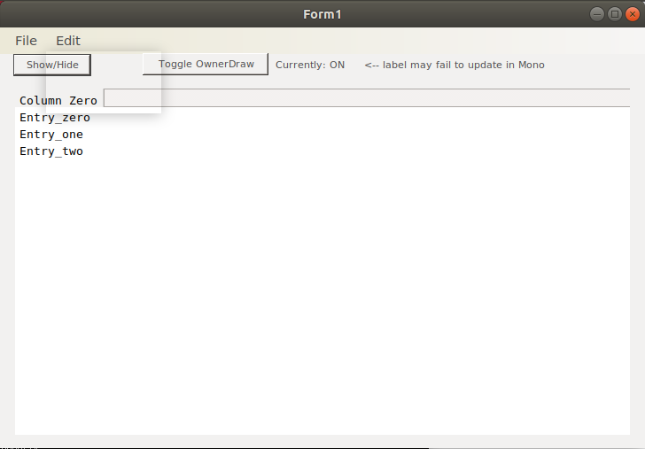

# Mono Bug Samples #

While trying to get a WinForms application to work under Mono on Linux, I
ran into some crashes and strange behavior.  These projects are small test
cases created to demonstrate the problems.  Because I'm specifically
interested in having code developed in Windows run on Linux, the projects
are created as Visual Studio solutions (VS 2017 Community Edition).

## DisappearingMenus ##

*(Noticed in: Mono 5.18.0.240, on Ubuntu 18.04.2 LTS)*

Using an owner-drawn ListView can cause menu items and dialogs to be
rendered as a semi-transparent rectangle.  Looks like this (after clicking
on the Edit menu):

Procedure: launch DisappearingMenus.  Confirm the File/Edit menu items
render.  Click "Show/Hide" to show the ListView.  Try to select something
from a menu.  Note the semi-transparent rects.

Additional remarks:

 * The menus are functional, just not drawn.
 * If you toggle OwnerDraw off, the menus reappear.  Note the OwnerDraw
   status label doesn't always update under Mono.
 * If you launch the app and click Show/Hide three times (show, hide, show),
   the menu rendering starts working again.  If you then toggle OwnerDraw off
   and back on, it stops working again.

